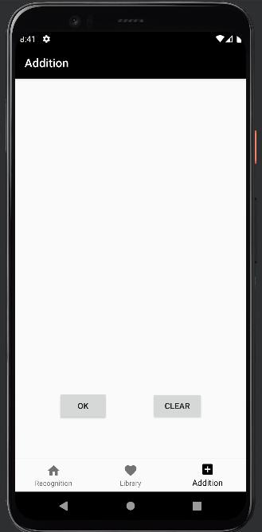
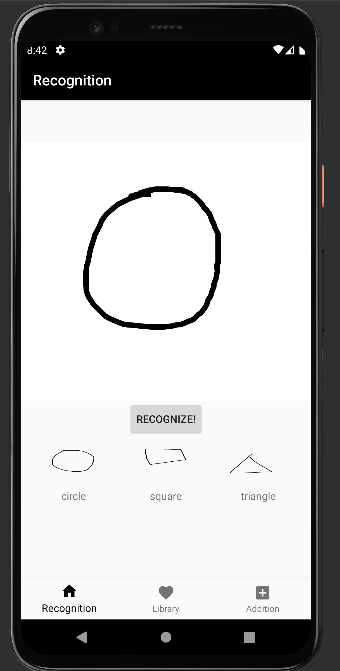
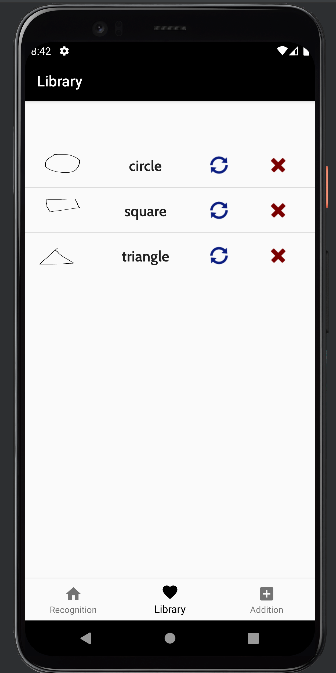

# Gesture Recognizer

#  Table of Contents
1. [General Info](#general-info)
2. [Requirements](#requirements)
3. [Screenshots](#screenshots)
4. [Technologies](#technologies)
5. [Installation](#installation)
6. [How to use?](#how-to-use)

# General Information

Gesture Recognition is an android application that allows users to create, apply, and manage one-stroke touch gestures.

# Requirements

Android 11.0(R) API level 30 is required to run this application.

# Screenshots

User can add one-stroke gesture in the addition fragment view. \
 

In the recognition fragment, it allows to find top 3 best match gesture. \

In the library fragment, users could manage their gestures.

# Technologies
* Java
* Android Studio 
* Android 11.0+(R) API level 30

# Installation

$ git clone https://github.com/yeeunPark0630/RecognizeGesture.git

1. Open Android Studio, and open workspace of RecognizeGesture.
2. Install Android 11.0(R) API level 30, and add virtual device with it.
3. Build this application, and run.

# How to use?

## Addition 

Draw one-stroke gesture in the canvas, and press ok button to add a gesture.  
Once user click ok button, the dialog box would appear for adding gesture with its name. Click add button for adding it in the library, and click cancel to return to the canvas.  
If user want to clear the canvas, they can click clear button.  

## Recognition 

Draw one-stroke gesture in the canvas, and click RECOGNIZE button at the center.  
Top-3 matched gestures appear at the bottom of screen after user click the button.  

## Library

Library fragment allows users to manage their gestures. Once users add gestures, it is added to the library immediately.  
If users click blue replacement button, user can modify the gesture.  
When users want to remove the gestures, they could just simply click red X button.  
